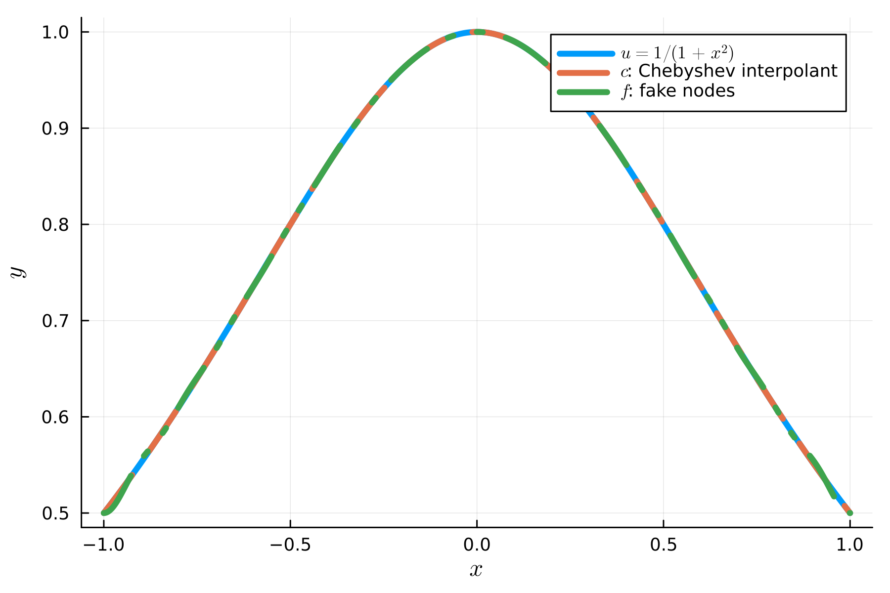

Can we use equispaced grids for global polynomial interpolation?
One of the answers will be "NO", due to the Runge effect.
Analyses based on the Lebesgue constant give us insights into why equispaced grids are bad, and why Chebyshev grids are good for global polynomial interpolation.

However, we can use a simple trick to interpolate data on an equispaced grid without the Runge effect.
In this post, we introduce "[Fake Nodes](https://github.com/pog87/FakeNodes)".

It's really simple.
If we have $\\{ (x_i, y_i) \lvert i=0, 1, \dots, N\\}$ where $x_i = $, it forms a data on an equispaced grid.
In this case, we define a map $S(x) = \cos( 0.5 \pi (x+1))$ and let $s_i = S(x_i)$.
$S$ is a one-to-one map onto the set of corresponding Chebyshev points.
Since we have $\\{(s_i, y_i) \lvert i=0, 1, \dots, N\\}$ on a Chebyshev grid, Chebyshev polynomial interpolation gives quite an impressive result.

As you can see from the plot, polynomial interpolation with data on an equispaced grid (Green) is almost the same as the Chebyshev interpolant (Blue).