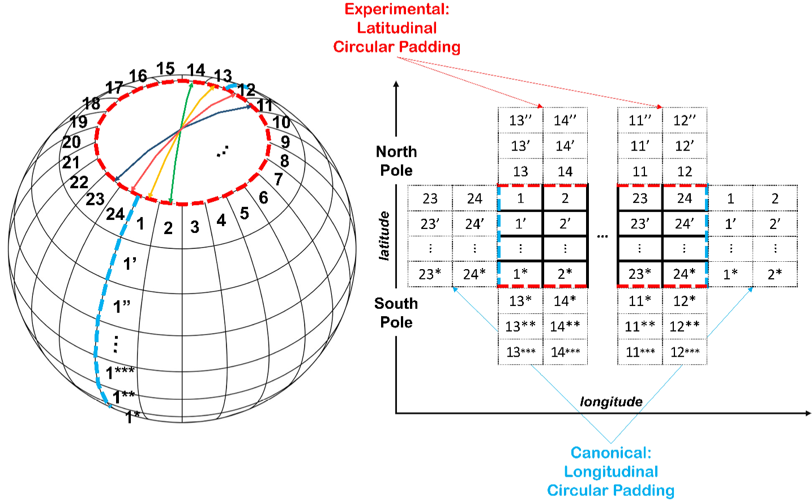

---
date:
  created: 2024-08-12
  #updated: 2024-08-09

categories:
  - NumericalWeatherPrediction
draft: true
---

# Review: KARINA

[KIST](https://www.kist.re.kr/eng/index.do)에서 KARINA[@cheon2024karina]라는 pure deep learning based climate forecast 모델을 개발했다고 한다.
(KARINA는 KIST's Atmospheric Rhythm with Integrated Nerual Algorithm의 약자이다.)
기존 모델들에 비하여 성능이 떨어지지 않으며 training time을 줄여 efficiency를 확보했다고 한다.

## Summary
내가 이해하기로는 두 가지 방법을 제안한 것 같다.

1. Geocyclic Padding
2. SENet

**Geocyclic Padding.**
기후 dataset은 정해진 경도, 위도, 그리고 고도에서 측정/계산된 값들로 이루어져 있다.
하지만 지구는 둥글기 때문에, 경도/위도가 지구의 geometry를 반영하도록 data를 전처리 하는 방법 중 하나를 이 논문에서 제안했고, Geocyclic Padding이라고 이름 붙였다.

<figure markdown="span">
  
  <figcaption>Figure 2 in the paper. Geocyclic Padding.</figcaption>
</figure>

**SENet.**
Climate data는 고도에 대해 multi-channel을 이루고 있다.
SENet은 multi-channel dataset을 다루는데 효과적이라고 알려져 있다고 한다.

## Review
이 논문은 현재 preprint 상태이다.
읽어보고나서 아래와 같은 내용들이 궁금해졌다.

- 본문 figure 3에 geocyclic padding과 SENet에 대한 ablation study 결과가 나와있다. (그림의 resolution이 좋지 않으므로 이 포스트에 싣지 않았다.)
Uncertainty plot이 있었다면 저자들의 주장에 무게가 더 실렸을 것 같다.
하지만 climate model은 굉장히 무겁기 때문에 uncertainty plot까지 바라는 것은 과하다고 생각이 들기도 한다.

- Model efficiency 측면에 대해 설명이 조금 부족한 것 같다. Model의 어떠한 부분에서 efficiency가 좋아졌는지, 다른 모델과 efficiency 측면에서 비교는 어떠한지에 대해 간략한 설명이 있으면 좋을 것 같다. 또한 최근 large model의 규제가 FLOPs count 기준으로 이루어지고 있다는 점에서, 해당 metric이 포함된다면 좋을 것이다.

- ECMWF S2S 모델과 비교했을 때 더 좋은 accuracy를 얻었다고 했지만, GraphCast나 Pangu weather와 비교해서는 day 7 예보를 제외하고는 accuracy가 조금 떨어지는 것 같다 (Table 3). 그럼에도 new benchmark를 정립했다고 abstract에 작성하는게 fair한지는 잘 모르겠다.