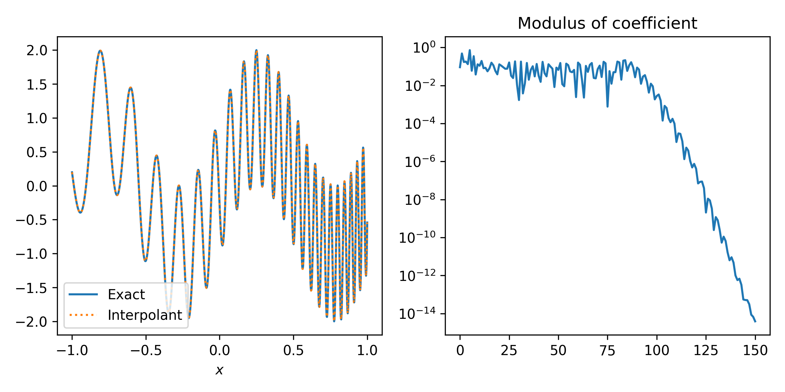
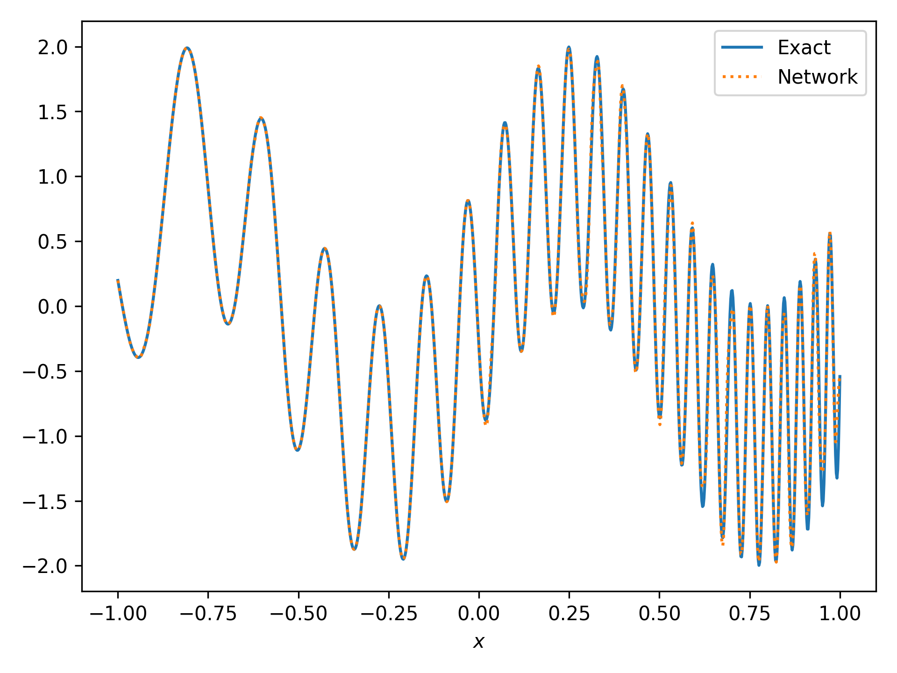

---
date:
  created: 2024-08-13
  #updated: 2024-08-09

categories:
  - Research
  - English Posts

draft: true
---

# Introduction to spectral learning

In this post, we introduce the spectral learning framework.
This framework is just learning a spectral representation of a function.
Recall the definition of the inverse Fourier transform.

$$\mathcal{F}^{-1}[\hat{u}](x) = \int e^{i2\pi \xi x} \hat{u}(\xi) d\xi.$$

It is well known that $\mathcal{F}^{-1}[\hat{u}] = u$ whenever $u \in L^1$.
This means, we can reconstruct the original function $u$ from its spectral representation $\hat{u}$.

However, will it be useful?

<!-- more -->


## Motivation
Let's investigate it.

Let $u$ be the target function defined on the inverval $[-1, 1]$, given by

$$u(x) = \sin(6x) + \sin(60 e^x).$$



The above figure shows the Chebyshev series truncated at $N=150$.
It resolves the original function at the error of $10^{-14}$.
We can see the nice alignment between $u$ and the interpolant.

However, nerual network approximation is not so good.



The above figure shows the regression result.
The training points are `np.linspace(-1, 1, 151)`.
Near $x=1$, we can see deviations.
The relative $L^2$ error is **5.075e-2**.

The spectral learning framework results in the following figure.


We cannot see any deviations.
The relative $L^2$ error is **3.367e-4**, two orders of magnitude smaller than the naïve regression result.


## Method

It is simple.
Just regress $\hat{u}(\xi)$ by a neural network.
However, we need an appropriate basis to compute $\hat{u}$.
In this post, we use the Chebyshev polynomials as our basis.
Other classes, like Legendre, Fourier, Spherical harmonics, etc, are also possible.

### Relative loss

Instead of naïve MSE, we may use

$$L(\theta) = \int \frac{(\hat{u}_\theta(\xi) - \hat{u}(\xi))^2}{\hat{u}(\xi)^2 + \epsilon} d\xi.$$

Since the Chebyshev coefficients decay rapidly, high modes are relatively small.
Thus high modes will not be approximated properly during the training process.
The relative loss might balance between small scale features and large scale features and improve the accuracy.

### Decay property

Neural network does not have rapid decay property.
However, the spectral representation decays rapidly, as shown in the first figure.
So, enforcing rapid decay property might improve the accuracy.

We may use the following form of a neural network,

$$\hat{u}_\theta(\xi) = \mathrm{Net}_\theta(\xi) \exp\left(-\tau^2 (\xi - \mu)^2\right)$$

to enforce fast decaying rate of Chebyshev coefficients.

$\mu, \tau$ can be learnable parameters.

## Results

We compare the performance of proposed methods.
We truncate the Chebyshev series at $N=150$.
Optimization: Adam 100K, L-BFGS 100K.

| Decaying \ Relative Loss | Yes  | No |
|---|---|---|
| Yes | 6.223e-6  | 3.594e-5  |
| No  | 3.367e-4  | 4.097e-5  |

The separate effects of enforcing decaying property and introduction of relative loss seem to be not so good.
However, the combination of them reduces the error approximately one order of magnitude.


## Code

Python Script:

```python
import time

import equinox as eqx
import fire
import jax
import jax.numpy as jnp
import jax.random as jr
import jaxopt
import matplotlib.pyplot as plt
import numpy as np
import optax
from numpy.polynomial import chebyshev as cheb


def main(
    relative_loss: bool = False,
    decaying: bool = True,
    epoch: int = 5,
    drawing: bool = False,
    spectral: bool = True,
):
    # Target function. Difficult to approximate.
    def f(x):
        return np.sin(6 * x) + np.sin(60 * np.exp(x))

    cc = cheb.chebinterpolate(f, 150)
    xx_test = np.linspace(-1, 1, 1000)
    ff = f(xx_test)
    if drawing:
        reconstruction = cheb.chebval(xx_test, cc)
        print(
            f"Interpolation: {np.linalg.norm(ff - reconstruction) / np.linalg.norm(ff):.3e}"
        )
        _, (ax0, ax1) = plt.subplots(nrows=1, ncols=2, figsize=(8, 4))
        ax0.plot(xx_test, ff, label="Exact")
        ax0.plot(xx_test, reconstruction, ":", label="Interpolant")
        ax0.legend()
        ax0.set_xlabel(r"$x$")

        ax1.semilogy(np.abs(cc))
        ax1.set_title("Modulus of coefficient")
        plt.tight_layout()
        plt.savefig("Interpolation.png", dpi=300)

    # Neural Network Setup

    class MLP(eqx.Module):
        """
        Multi-Layer Perceptron.
        w0 is a frequency hyper-parameter.
        """

        layers: list
        mu: jax.Array
        tau: jax.Array
        w0: float = eqx.field(static=True)

        def __init__(self, d_in, width, depth, d_out, *, w0=10.0, key):
            layers = [d_in] + [width for _ in range(depth - 1)] + [d_out]
            keys = jr.split(key, depth)
            self.layers = [
                eqx.nn.Linear(_in, _out, key=_k)
                for _in, _out, _k in zip(layers[:-1], layers[1:], keys)
            ]
            self.w0 = w0
            self.mu = jnp.array(0.0)
            self.tau = jnp.array(1.0)

        def __call__(self, inputs):
            if decaying:
                gaussian = jnp.exp(-((self.tau * (inputs - self.mu)) ** 2))
            else:
                gaussian = 1.0
            inputs = jnp.sin(self.w0 * self.layers[0](inputs))
            for layer in self.layers[1:-1]:
                inputs = jnp.tanh(layer(inputs))
            return self.layers[-1](inputs) * gaussian

    model = MLP("scalar", width=64, depth=3, d_out="scalar", key=jr.key(0))

    xx = np.linspace(-1, 1, 151)

    if spectral:
        if relative_loss:

            def loss(model):
                pred = jax.vmap(model)(xx)
                rel_loss = (pred - cc) ** 2 / (jnp.abs(cc) ** 2 + 1e-3)
                return rel_loss.mean()
        else:

            def loss(model):
                pred = jax.vmap(model)(xx)
                return ((pred - cc) ** 2).mean()

    else:
        true = f(xx)

        def loss(model):
            pred = jax.vmap(model)(xx)
            return ((pred - true) ** 2).mean()

    print("Fitting a neural network..")
    adam = jaxopt.OptaxSolver(loss, optax.adam(1e-3), maxiter=10**epoch, tol=1e-13)
    lbfgs = jaxopt.LBFGS(loss, maxiter=10**5, tol=1e-13)
    tic = time.time()
    model, state = adam.run(model)
    model, state = lbfgs.run(model)
    toc = time.time()

    if spectral:
        pred = jax.vmap(model)(xx)
        pred = cheb.chebval(xx_test, pred)
    else:
        pred = jax.vmap(model)(xx_test)

    print(f"""Done! Elapsed time: {toc - tic:.2f}s.
          Configuration.
          Relative Loss? {relative_loss}.
          Decaying? {decaying}.
          Spectral? {spectral}.
          Epoch: {10**epoch}.
          Error: {np.linalg.norm(pred - ff) / np.linalg.norm(ff):.3e}.
          mu: {model.mu}.
          tau: {model.tau}.""")

    plt.cla()
    _, ax = plt.subplots()
    ax.plot(xx_test, ff, label="Exact")
    ax.plot(xx_test, pred, ":", label="Network")
    ax.legend()
    ax.set_xlabel(r"$x$")
    plt.tight_layout()
    plt.savefig(
        f"decaying{decaying}_relativeloss{relative_loss}_spectral{spectral}.png",
        dpi=300,
    )


if __name__ == "__main__":
    import fire

    print(f"JAX Precision Check: {jnp.array(1.).dtype}")
    fire.Fire(main)

```

Shell script:

```console
#!/bin/bash

export JAX_ENABLE_X64=True

python main.py --decaying=True --relative_loss=True --drawing=True
python main.py --decaying=True --relative_loss=False
python main.py --decaying=False --relative_loss=True
python main.py --decaying=False --relative_loss=False
python main.py --decaying=False --relative_loss=False --spectral=False
```