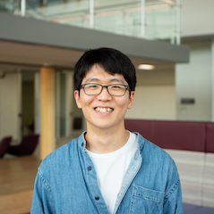

I'm Jaemin Oh (오재민, 吳宰旼), a postdoc at Brown University.

I am working at the intersection of machine learning and numerical analysis (SciML), developing hybrid algorithms for partial differential equations and data assimilation. 

{ align=left }
/// caption
Photo credit: [Byung-Jun Yoon](https://biomlsp.com)
///

For more information, please refer to my [CV](https://drive.google.com/file/d/1X09GQZy3K4BWqaWKgSRgWkTFbIYKUJ3h/view?usp=share_link), [Google scholar :simple-googlescholar:](https://scholar.google.com/citations?user=_DhCnsYAAAAJ&hl=en), and [GitHub :simple-github:](https://github.com/jaeminoh).


**Education**

- Ph.D. Aug. 2020 - Feb. 2025, department of mathematical sciences, Korea advanced institute of science and technology (KAIST), Daejeon, South Korea (advisor: Professor [Youngjoon Hong](https://youngjoonhong.com))
- B.S. Mar. 2015 - Aug. 2020, department of mathematics, Korea University, Seoul, South Korea
    - Military Service, Feb. 2017 - Feb. 2019 @ Korea Air Force, Weather Wing.


**News**

- (01/15/2026) I will be starting a new postdoc position at Brown University.
- (11/07/2025) I will be delivering a talk at the Crunch Seminar at Brown University.


**Contact**

``` py
first_name = jaemin
last_name = oh
print(f"email: {first_name}_{last_name}🐌tamu.edu")
```

Please feel free to reach out to me for anything you need!